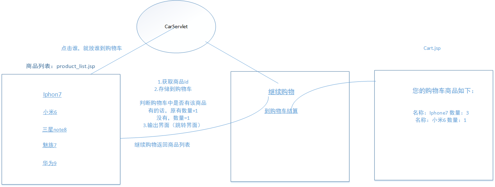

## 简单购物车

* 思路解析

*  代码结构

* D:\file\java\study\SessionDemo02\src\com\seu\servlet
	* CarServlet.java 功能：实现获取商品id,将商品家到购物车，并且输出到界面
	* ClearCartServlet.java 功能：清除购物车

* D:\file\java\study\SessionDemo02\WebContent
	* product_list.jsp 功能：实现一些简单的商品的超链接
	* cart.jsp 点击到购物车结算时跳转的页面。功能：显示购物车已购商品，提供清除购物车等
